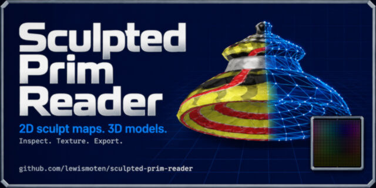
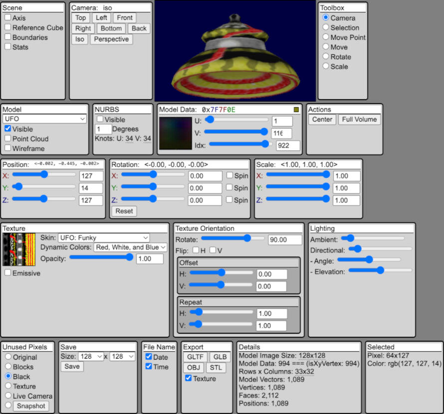

# Sculpted Prim Toolkit



An in-browser viewer and editor for Second Life-style sculpted prim maps. It reads the RGB position data stored in a 2D image, turns it into an interactive Three.js model, and can export the resulting geometry or updated sculpt map.



## Features

- Browse the included sculpt-map and texture libraries.
- Inspect a real-time 3D preview with orbit, orthographic/perspective, isometric, and face-oriented camera views.
- Show axes, a reference cube, model bounds, point clouds, wireframes, NURBS surfaces, and performance statistics.
- Select and edit individual vertices from the 2D map or directly in the 3D scene; move, rotate, scale, center, and fit models to the bounding volume.
- Preview source RGB position data, selected pixel coordinates, rows/columns, and mesh statistics.
- Apply image textures or generated vertex-color, density, distance, and face-angle maps.
- Control texture opacity, emission, rotation, flip, offset, and repeat.
- Choose how unused sculpt-map pixels are represented: original pixels, blocks, black, texture, a live camera view, or a snapshot.
- Export a PNG sculpt map and 3D models as glTF, GLB, OBJ (with optional MTL/PNG texture), or binary STL.

## Try it locally

Requirements: a current Node.js LTS release and npm.

```sh
npm install
npm start
```

The development server opens `http://localhost:5174/src/index.html`.

## GitHub Pages

This repository includes a root-level `index.html` intended for static GitHub Pages hosting. It loads the application and its assets from `src/` and uses the pinned Three.js browser module map in that page, so no server-side runtime is required.

To publish from GitHub:

1. Push this repository to GitHub.
2. Open **Settings → Pages**.
3. Under **Build and deployment**, choose **Deploy from a branch**.
4. Select the branch to publish and the `/(root)` folder, then save.

After GitHub finishes publishing, the app is available at the repository’s Pages URL. The page requires a modern browser with WebGL and network access to `unpkg.com` for Three.js modules.

## Project layout

```text
index.html                  GitHub Pages entry point
src/index.html              Development entry point
src/index.js                Viewer, editor, rendering, and export logic
src/style.css               Application styling
src/files.json              Display names and the image library index
src/images/sculpted-prims/  Included sculpt maps
src/images/textures/        Included texture maps
scripts/create-directory-json.js  Refreshes the image library index
misc/                       Reference assets and project media
```

## Adding images

Put new sculpt maps in `src/images/sculpted-prims/` and textures in `src/images/textures/`, then refresh the selector metadata:

```sh
npm run create-directory-json
```

Commit the new images and the updated `src/files.json` together.

## Video progress log

The project’s development series is available on YouTube:

1. [UFO on a web page](https://www.youtube.com/watch?v=egAIXJwAAHw&list=PLIyz44ZkJ3sk&index=1)
2. [Paint UFO in 2D and 3D](https://www.youtube.com/watch?v=I-39pDKeUSM&list=PLIyz44ZkJ3sk&index=2)
3. [Wired up Three.js Orbit Controls](https://www.youtube.com/watch?v=ucCYsu5D82U&list=PLIyz44ZkJ3sk&index=3)
4. [Sculpted prim web page](https://www.youtube.com/watch?v=IvugXCUllp8&list=PLIyz44ZkJ3sk&index=4)
5. [Mapping textures to sculpted prims on a web page](https://www.youtube.com/watch?v=6RKzPEzNP7M&list=PLIyz44ZkJ3sk&index=5)
6. [Aligning textures, cameras, and more](https://www.youtube.com/watch?v=542heVtdaIs&list=PLIyz44ZkJ3sk&index=6)
7. [Troubleshooting U in UV](https://www.youtube.com/watch?v=vab_7DIBV-M&list=PLIyz44ZkJ3sk&index=7)
8. [Texture mapping fixed](https://www.youtube.com/watch?v=JCMx8ZGvNA8&list=PLIyz44ZkJ3sk&index=8)
9. [Modeling with NURBS](https://www.youtube.com/watch?v=UdG17dy4lsM&list=PLIyz44ZkJ3sk&index=9)
10. [Moving a vertex](https://www.youtube.com/watch?v=WL7ULY4MXYY&list=PLIyz44ZkJ3sk&index=10)
11. [NURBS and transform controls](https://www.youtube.com/watch?v=XR4lTaVBr0w&list=PLIyz44ZkJ3sk&index=11)
12. [Watermarking sculpted prims](https://www.youtube.com/watch?v=DD1e7O6_R0Y&list=PLIyz44ZkJ3sk&index=12)
13. [Expanding geometry to full volume](https://www.youtube.com/watch?v=Rwv-DyjmYZw&list=PLIyz44ZkJ3sk&index=13)
14. [Exporting files](https://www.youtube.com/watch?v=iGebrHMeR9o&list=PLIyz44ZkJ3sk&index=14)
15. [UV/face density map in the module editor](https://www.youtube.com/watch?v=5ebv8YVMZ8w&list=PLIyz44ZkJ3sk&index=15)
16. [Density maps progress](https://www.youtube.com/watch?v=oEFn9l4U_1Q&list=PLIyz44ZkJ3sk&index=16)
17. [Density, distance, and angle texture maps](https://www.youtube.com/watch?v=NeDgnkp_Tw0&list=PLIyz44ZkJ3sk&index=17)
18. [Overview of reading and writing sculpted prims](https://www.youtube.com/watch?v=KSIaYGQd8t4&list=PLIyz44ZkJ3sk&index=18)

## License

This project’s source code is available under the [MIT License](./LICENSE).

The bundled sculpt maps, textures, and other media may have separate authorship or usage requirements. Confirm you have the appropriate rights before redistributing those assets or including them in derivative work.
